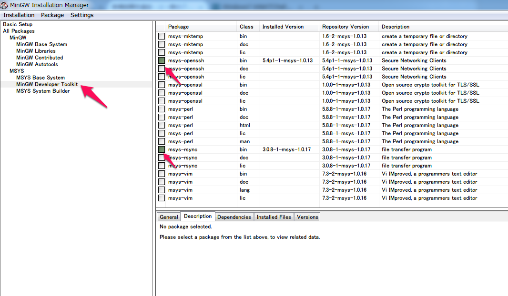

DAY13: Use knife-solo instead of vagrant chef-solo provision
============================================================


When provisioning for virtual machines, we use vagrant chef-solo for applying chef setting.
To be honest, we want to change them like below.

1. Simply init virtual machine by vagrant
2. Run original knife-solo to that virtual machine

Because it's more beneficial for all of the cases.
If we simply change the target of knife-solo, for example, for production servers,
we can setup infrastructure settings for the production server easily.

In most cases, just using vagrantfile chef-solo is easy to write and easy to setup.
That's the reason why we're currently doing it with those kind of way. But again, we want to change them!


### First Step: Try it with sample project

Clone [rakuichi-rakuza project](https://github.com/aucfan/rakuichi-rakuza) into your local PC. Check vagrant README here. Checkout ``upuser-update`` branch please.

```
https://github.com/aucfan/rakuichi-rakuza/tree/feature/upuser-update/vagrant
```

#### How to run chef-solo (Linux/Mac) (Copied from rakuichi-rakuza README files)

Install [Knife-solo](http://matschaffer.github.io/knife-solo/) to your computer
or virtual machine.

```sh
$ ## Clone & checkout project
$ git clone git@github.com:aucfan/rakuichi-rakuza.git
$ cd rakuichi-rakzua
$ git checkout upuser-update
$
$ ## up virtual machines
$ cd vagrant
$ vagrant up rakuichi-rakzua.chef
$
$ ## register ssh-config for non-pass ssh authentications
$ vagrant ssh-config rakuichi-rakzua.chef >>~/.ssh/config
$
$ ## run cookbook via knife-solo
$ knife solo prepare rakuichi-rakzua.chef
$ knife solo cook rakuichi-rakzua.chef
```

This is the instructions for Mac/Linux settings.
Please search it and apply for your Windows machine settings.
If you finished, create README files for next Windows users if possible.


#### How to run chef-solo (Windows)

1.  Download and install Ruby and Development kit.

    ```
    - [Ruby 2.0.0 32bit](http://dl.bintray.com/oneclick/rubyinstaller/rubyinstaller-2.0.0-p598.exe?direct)
    - Ruby development kit [mingw64-32-4.7.2](http://cdn.rubyinstaller.org/archives/devkits/DevKit-mingw64-32-4.7.2-20130224-1151-sfx.exe) for Ruby 2.0.0 32bit
    ```

    **NOTE:** You need install the right one for your version of Ruby

    Run Ruby development kit to extract it to somewhere (D:/devkit).

    Open cmd, then cd to it (cd D:/devkit), then run ``` ruby dk.rb init ``` and ``` ruby dk.rb install ``` to bind it to ruby installations in your path.

2.  Install knife-solo.

    Run command

    ```
    - gem install librarian-chef
    - gem install knife-solo
    ```
    
3.  Install MinGW - Minimalist GNU for Windows.

    [Official site](http://sourceforge.net/projects/mingw/files/Installer/) download and install the mingw-get-setup.exe from.

    Installation path was used for default.

    ```
    C:\MinGW
    ```
    
4.  Installation of mysys-openssh and msys-rsync

    Run MinGW Installation Manager from ``` C:\MinGW\bin\mingw-get.exe ```

    Then the following like the screen to install the mysys-openssh and msys-rsync.
    

    Then click on menu : Installation -> Apply changes

    Setup PATH environment variable.
    ```
    C:\MinGW\bin;C:\MinGW\msys\1.0\bin
    ```

    Open the C:\MinGW\msys\1.0\etc\fstab and add the following. ( There is a file called fstab.sample in the same hierarchy, we use it to rename it to fstab.) 
    ```
    c: /cygdrive/c
    d: /cygdrive/d
    ```
    
5.  Run knife solo (**WARNING:** Only use cmd)

    ```
    $ ## up virtual machines
    $ cd vagrant
    $ vagrant up rakuichi-rakzua.chef
    $
    $ ## register ssh-config for non-pass ssh authentications
    $ vagrant ssh-config rakuichi-rakuza.chef >> C:/Users/[USER-NAME]/.ssh/config
    $
    $ ## run cookbook via knife-solo
    $ knife solo prepare rakuichi-rakuza.chef
    $ knife solo cook rakuichi-rakuza.chef
    ```

    
### Make the project

Let's make [alermo project](https://github.com/aucfan/alermo) chefnize!


Current Vagrantfiles

```
# -*- mode: ruby -*-
# vi: set ft=ruby :

Vagrant.configure("2") do |config|
  config.vm.box = "centos64_ja"
  config.vm.box_url = "https://dl.dropboxusercontent.com/u/3657281/centos64_ja.box"

  config.vm.define :web1 do |web|
    web.vm.network :private_network, ip: "192.168.33.103"
  end

  config.vm.synced_folder "../", "/var/www/html", :create => true, :owner=> 'vagrant', :group=>'vagrant', :mount_options => ['dmode=777,fmode=755']

  config.vm.provider :virtualbox do |vb|
    #vb.customize ["modifyvm", :id, "--memory", 1024]
    vb.customize ["modifyvm", :id, "--natdnshostresolver1", "on"]
    vb.customize ["modifyvm", :id, "--natdnsproxy1", "on"]
  end

  config.vm.provision :chef_solo do |chef|
    chef.add_recipe "base"
    chef.add_recipe "php-mysql-httpd"
    chef.add_recipe "alermo"
    chef.add_recipe "composer"
    chef.json = {
      :composer => {
        :install_path => "/usr/local/bin"
      }
    }
  end
end
```


Our ideal Vagrantfile.

```
# -*- mode: ruby -*-
# vi: set ft=ruby :

Vagrant.configure("2") do |config|
  config.vm.box = "centos64_ja"
  config.vm.box_url = "https://dl.dropboxusercontent.com/u/3657281/centos64_ja.box"

  ## We want to run knife-solo(chef-solo) to this virual machine 'chefweb'
  config.vm.define :chefweb do |web|
    web.vm.network :private_network, ip: "192.168.33.103"
  end

  config.vm.define :vagrantweb do |web|
    web.vm.network :private_network, ip: "192.168.33.104"
    web.vm.synced_folder "../", "/var/www/html", :create => true, :owner=> 'vagrant', :group=>'vagrant', :mount_options => ['dmode=777,fmode=755']
    web.vm.provider :virtualbox do |vb|
      #vb.customize ["modifyvm", :id, "--memory", 1024]
      vb.customize ["modifyvm", :id, "--natdnshostresolver1", "on"]
      vb.customize ["modifyvm", :id, "--natdnsproxy1", "on"]
    end
    web.vm.provision :chef_solo do |chef|
      chef.add_recipe "base"
      chef.add_recipe "php-mysql-httpd"
      chef.add_recipe "alermo"
      chef.add_recipe "composer"
      chef.json = {
        :composer => {
          :install_path => "/usr/local/bin"
        }
      }
    end
  end

end
```

