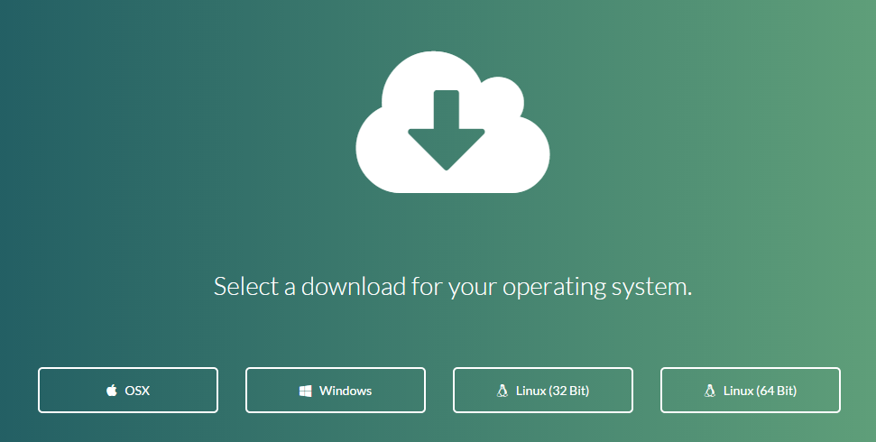
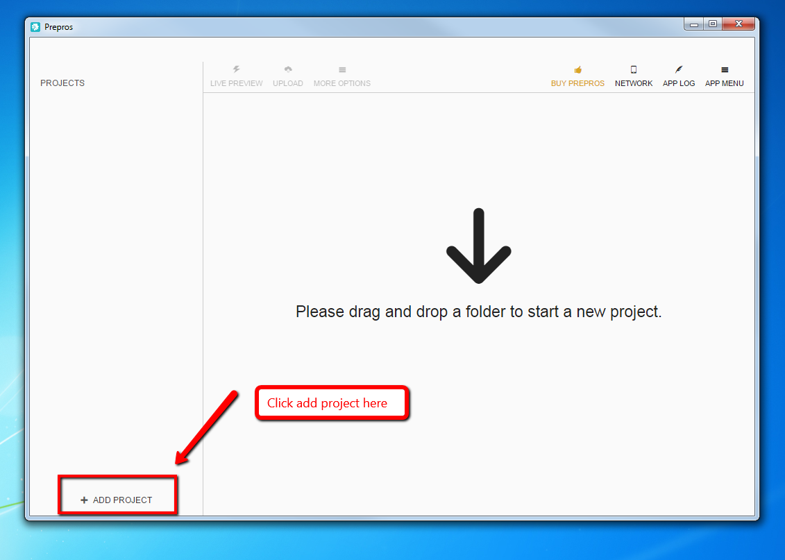
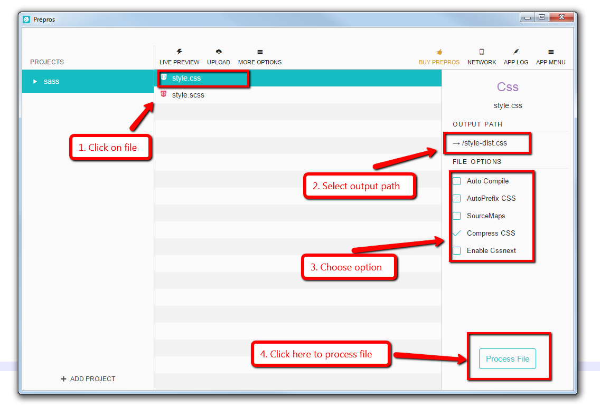

phuc-test
=========


### Setup staging environment

```
$ cd vagrant
$ vagrant up
```


Set /etc/hosts like below

```
dev.btob-market.com  192.168.33.104
```

Then you can staging environment

```
http://dev.btob-market.com
```


### Install Prepros tool

1.  Download Prepros and install it.

    -	Download link

    ```
    https://prepros.io/downloads
    ```

    -	Choose OS that you use.
    
    -	Install it to your computer.

2.  Create new folder.

    -	Create your new folder (ex: sass folder).
    -	Copy file css or image to this folder.

3.  Start using Prepros.

    -	Open up Prepros.
    -	Add project on Prepros.
    
    -	Choose the new folder above (ex: sass folder).
    -	Choose one file that you want compress.
    -	Click "Process File".
    
    -	Prepros will compress your file.


### Install Grunt on Windows

1.  Download and install Node.js

    -   Download link (choose .msi version)

    ```
    http://nodejs.org/download/
    ```

    -   Install Node.js, change directory to ``` C:\nodejs ```
    -   Check npm work:

    ```cmd
    > npm -v
    1.4.28
    ```

2.  Install Grunt
    
    ```cmd
    > npm install -g grunt-cli
    ```

    -   Check Grunt work:

    ```cmd
    > grunt -V
    grunt-cli v0.1.13
    ```

3.  Setup Grunt into btob-market repository

    -   Go to the project's root directory.

    ```
    \apache\vhosts\www.btob-market.com\htdocs
    ```

    -   Create package.json file

    ```
    {
        "name": "btob-market",
        "version": "0.1.0",
        "description": "A packaged for btob-market",
        "private": true,
        "repository": {
            "type": "svn",
            "url": ""
        },
        "engines": {
            "node": ">= 0.8.0"
        },
        "devDependencies": {
            "grunt": "~0.4.5",
            "grunt-contrib-concat": "~0.5.0",
            "grunt-contrib-uglify": "~0.6.0",
            "grunt-contrib-watch": "~0.6.1"
        }
    }
    ```

    -   Open cmd and cd to root directory.
    -   Run cmd ``` npm install ``` to install package module
    -   Create Gruntfile.js file

    ```
    module.exports = function (grunt) {
        var pkg = grunt.file.readJSON('package.json');
        grunt.initConfig({
            concat: {
                files: {
                    src : 'js/*.js',
                    dest: 'js/concat/hogehoge.js'
                }
            },

            uglify: {
                dist: {
                    files: {
                        'js/min/sample.min.js': 'js/concat/hogehoge.js'
                    }
                }
            },

            watch: {
                js: {
                    files: 'js/*.js',
                    tasks: ['concat', 'uglify']
                }
            }
        });

        grunt.loadNpmTasks('grunt-contrib-uglify');
        grunt.loadNpmTasks('grunt-contrib-concat');
        grunt.loadNpmTasks('grunt-contrib-watch');
        grunt.registerTask('default', ['concat', 'uglify']);
    };
    ```

    -   Run grunt.

    ```cmd
    > grunt
    Running "concat:files" (concat) task
    File js/concat/hogehoge.js created.

    Running "uglify:dist" (uglify) task
    >> 1 file created.

    Done, without errors.
    ```
    

## Apply serverspec into project on Windows

**Install serverspec**
```cmd
> gem install serverspec
```

**Started**
+ Open cmd and cd to vagrant folder, then run command:
```cmd
> serverspec-init
Select OS type:

  1) UN*X
  2) Windows

Select number: 1

Select a backend type:

  1) SSH
  2) Exec (local)

Select number: 1

Vagrant instance y/n: y
Auto-configure Vagrant from Vagrantfile? y/n: y
0) chefweb
1) vagrantweb
Choose a VM from the Vagrantfile: 0
 + spec/
 + spec/chefweb/
 + spec/chefweb/sample_spec.rb
 + spec/spec_helper.rb
```

+ Open spec/spec_helper.rb file

Current
```
config = Tempfile.new('', Dir.tmpdir)
`vagrant ssh-config #{host} > #{config.path}`

options = Net::SSH::Config.for(host, [config.path])
```

If you run machine with Chef, change to
```
config_path = "~/.ssh/config"
`vagrant ssh-config #{host} >> #{config_path}`
options = Net::SSH::Config.for(host, [config_path])
```

If you run machine with Knife-solo, change to
```
config_path = "~/.ssh/config"
`vagrant ssh-config #{host} >> #{config_path}`
`bundle exec knife solo prepare #{host}`
`bundle exec knife solo cook #{host}`
options = Net::SSH::Config.for(host, [config_path])
```

+ Run tests.
```cmd
> rake spec
```

+ Successfull
```
Package "httpd"
  should be installed

Service "httpd"
  should be enabled
  should be running

Port "80"
  should be listening

Finished in 0.21091 seconds (files took 6.37 seconds to load)
4 examples, 0 failures
```

+ Fail
```
Package "httpd"
  should be installed (FAILED - 1)

Service "httpd"
  should be enabled (FAILED - 2)
  should be running (FAILED - 3)

Port "80"
  should be listening (FAILED - 4)

...
```

### How to use gem Compass

1.  Install Compass

    -   Add ``` gem 'compass' ``` to Gemfile.
    -   Open cmd, cd to project folder has contain file ``` Gemfile ```.
    -   Run command ``` bundle install ``` to update compass.

2.  Use Compass

    -   Open project document root folder.
    -   Create a config file ``` config.rb ```
    
    ```
    css_dir = "sass/css"          #where the CSS will saved
    sass_dir = "sass"
    ```

    -   Open cmd, cd to project folder has contain file ``` Gemfile ```.
    -   Run command 

    ```cmd
    > bundle exec compass compile  ..\apache\vhosts\www.btob-market.com\htdocs
    ```

    -   It will compile scss file to css file in folder

    ```
    apache/vhosts/www.btob-market.com/htdocs/sass/css
    ```


### How to use Grunt Compass to compile and minify css

1.  Install Grunt Compass

    -   Open project document root folder.
    -   Add ``` grunt-contrib-compass ``` to file ``` package.json ```

    ```
    ...
    "devDependencies": {
        ...
        "grunt-contrib-compass": "~1.0.1"
    }
    ```

    -   Open cmd, cd to project document root folder.
    -   Run command to update compass.

    ```cmd
    > npm install
    ```

2. Use Grunt Compass

    -   Add task to ``` Gruntfile.js ```

    ```
    ...
    grunt.initConfig({
        compass: {// Task
            dev: {// Target
                options: {// Target options
                    sassDir: 'sass',
                    cssDir: 'css',
                    environment: 'development',
                    outputStyle: 'compressed'
                }
            }
        },
        ....
        watch: {
            compass: {
                files: ['sass/*.{scss,sass}'],
                tasks: ['compass:dev']
            },
            ...
        }
    });
    
    grunt.loadNpmTasks('grunt-contrib-compass');
    ...
    grunt.registerTask('default', ['compass', 'concat', 'uglify'])
    ```
    
    -   Run command ``` grunt ```


### How to use Grunt Cssmin to minify css

1.  Install Grunt Cssmin

    -   Open project document root folder.
    -   Add ``` grunt-contrib-cssmin ``` to file ``` package.json ```

    ```
    ...
    "devDependencies": {
        ...
        "grunt-contrib-cssmin": "~0.10.0"
    }
    ```

    -   Open cmd, cd to project document root folder.
    -   Run command to update compass.

    ```cmd
    > npm install
    ```

2. Use Grunt Cssmin

    -   Add task to ``` Gruntfile.js ```

    ```
    ...
    grunt.initConfig({
        cssmin: {
            minify: {
                expand: true,
                cwd: 'sass/css/',
                src: ['*.css', '!*-dist.css'],
                dest: 'sass/css/',
                ext: '-dist.css'
            }
        },
        ....
        watch: {
            compass: {
                files: ['sass/*.{scss,sass}'],
                tasks: ['compass:dev']
            },
            ...
        }
    });
    
    grunt.loadNpmTasks('grunt-contrib-cssmin');
    ...
    grunt.registerTask('default', ['compass', 'cssmin', 'uglify'])
    ```
    
    -   Run command ``` grunt ```


### How to use Grunt Compass to create css sprite image

    -   Open project document root folder.
    -   Add config option for compass into ``` Gruntfile.js ```

    